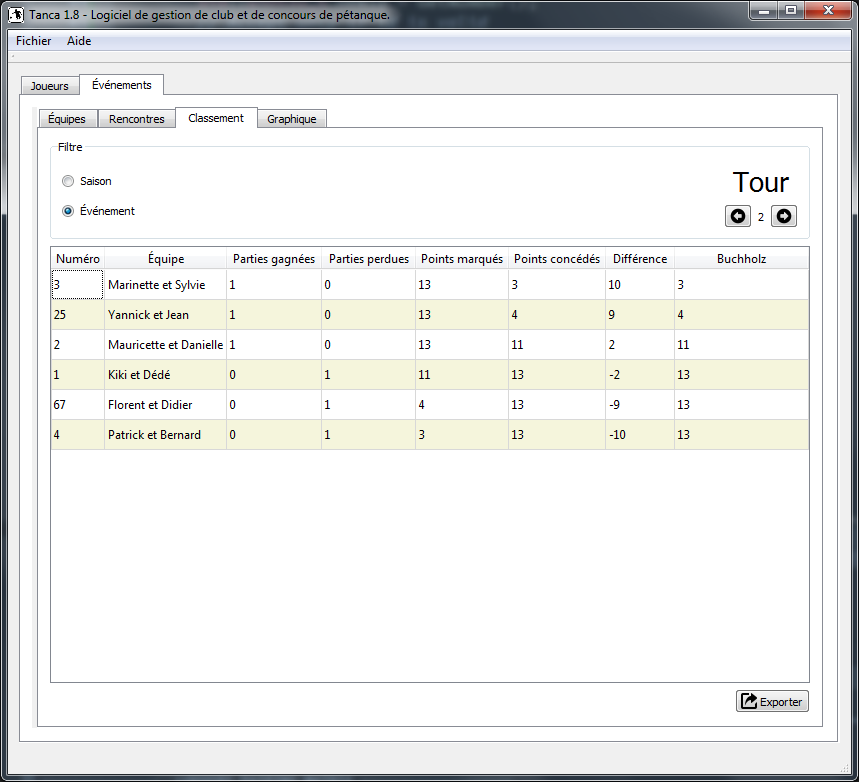

# Tanca, un gestionnaire de club et de concours de pétanque (petanque club and contests manager)

Tanca est un logiciel permettant de gérer un club de pétanque et d'organiser des concours internes. (Tanca will help petanque clubs to follow subscribers and organize in-house contests).

## Présentation

Tanca vous aide à organiser votre club de pétanque. Il vous permet de garder une trace de vos adhérents et de leurs informations et possèd eun module de création de concours.

Pour le moment, seul le concours de type "Tournoi Suisse" est supporté.

## Captures d'écrans

Liste des joueurs:

Classement de la saison du tournoi Suisse:

Liste des matches:

Liste des équipe participant à un événement:

Affichage des matches du tournoi:

## Historique des versions

### V1.6

 - Affichage de la différence de points dans le classement
 - Cosmétique : ajout d'icônes et de couleurs dans les tableaux

### V1.5

 - Exporter les matches d'un événement
 - Ajouter un nouveau type d'événement: tournoi suisse
 - Rendre configurable le nombre de tours de jeu
 - Ajouter un menu à propos avec lien vers Github et licence
 - Nouvelle interface de classement et de la liste des rencontres

### V1.4

 - Afficher le nom des joueurs dans les différents écrans afin de différencier les joueurs (les trois premières lettres du nom)
 - Afficher le nom complet dans la liste des équipes
 - L'ajout manuelle de parties
 - Ajouter la suppression d'un joueur (uniquement si pas de partie jouées associées)
 - Exporter la base de joueurs
 - Accepter des joueurs exemptés

### V1.3

 - Le formulaire d'édition d'un joueur fonctionne complètement + contrôle de la casse des prénom/nom
 - Lors de l'import, comparer les nom/prénom en minimisant la casse
 - Correction automatique de la casse des noms/prénoms/pseudonymes pour uniformiser l'affichage
 - Remplacement des listes par des tables avec classement automatique
 - Mettre en gris les lignes des parties terminées (pointage effectué)
 - Afficher calendrier graphique lors du choix de la date de l'événement
 - Suppression/édition des équipes
 - Edition/suppression d'un événement

### V1.2

 - Le classement par points de la saison est fonctionnel
 - Affichage des points dans la fenêtre des rencontres
 - Désactivation des boutons pas encore fonctionnels
 - Export du classement de la saison en fichier CSV

### V1.1

 - Le pointage des scores est possible
 - Nouvelles options lors de la création d'un événement
 - Correction sur la mise à jour de la fiche des joueurs
 - Correction de la génération des parties
 - Import des joueurs/adhérents à partir d'une liste CSV

### V1.0

 - Version initiale pour tests
 - Licencier tous les fichiers sources

## TODO

### V2.0

 - Intégrer villes.db pour les codes postaux
 - Ranger les événements par rapport à leur date
 - Ajouter un "supprimer tous" les tours de jeu
 - Différencier la création d'une équipe d'un jeu (mutualiser == mauvaise idée, surtout pour permettre un nom d'équipe :)
 - Ajouter la possibilité de créer un nom d'équipe (si vide == nom automatique)
 - Passer tous les qDebug() en TLogInfo()
 - Ajouter un nouveau type d'événement: les tournois (simple ou double élémination)
 - Passer de QtCanvas en QtQuick (préparer version mobile)
 - Effectuer les pointages directement sur le graphique
 - Ajout de champs dans la fiche joueur: sexe, nationalité, date du certificat médical, catégorie
 - Support des catégories (Vétéran, Sénior, Junior, Cadet, Minime, Benjamin)
 - Implémenter des statistiques pour un événement
 - Progression d'un joueur en graphique

## Swisss (round-robin) tournament algorithm

The classic algorithm works like this:

Number the teams 1..n. (Here I'll take n=8.)

Write all the teams in two rows.

1 2 3 4
8 7 6 5

The columns show which teams will play in that round (1 vs 8, 2 vs 7, ...).

Now, keep 1 fixed, but rotate all the other teams. In week 2, you get

1 8 2 3
7 6 5 4

and in week 3, you get

1 7 8 2
6 5 4 3

This continues through week n-1, in this case,

1 3 4 5
2 8 7 6

If n is odd, do the same thing but add a dummy team. Whoever is matched against the dummy team gets a bye that week.

